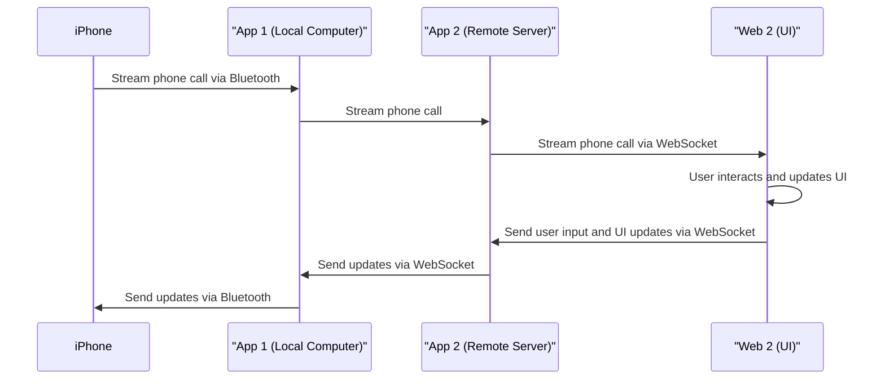
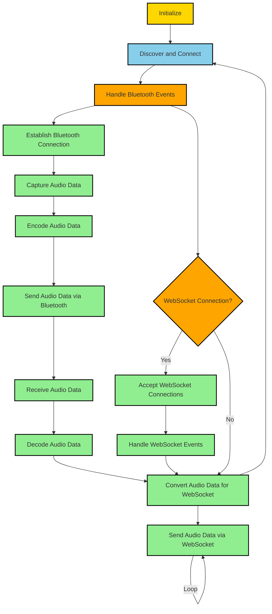

# App 1 - Bluetooth Audio Streamer

- Use Web Bluetooth API to receive audio input from Bluetooth device

- Encode audio data and stream it via WebSockets to App 2

# App 2 - Websocket Server & Visualization Frontend

- Implements a websocket server to receive the audio stream from App 1

- Broadcasts the audio stream to connected clients (frontend) 

- Includes frontend code to:

  - Connect to websocket server

  - Receive audio stream

  - Render visualization of audio stream

  - Play back audio stream

In this updated scope:

- App 1 handles receiving Bluetooth audio and streaming to App 2

- App 2 implements the websocket server to receive the stream AND the frontend code to visualize and playback the stream

No separate web UI client needed since App 2 includes both backend websocket server and frontend visualization code.

Let me know if you need me to clarify or expand on any part of this outline! I'm happy to explain further or provide code examples.


## App 1 - Bluetooth Audio Streamer

This app receives Bluetooth audio and streams it to App 2.

### 1. Create a new folder for the project

```bash
mkdir app1
cd app1
```

### 2. Initialize a Node.js project

```csharp
npm init -y
```

### 3. Install required packages

```
npm install web-bluetooth websocket
```

### 4. Create a file called `bluetooth-stream.js`

This file will handle Bluetooth audio streaming.

```javascript
// Import modules
const webBluetooth = require('web-bluetooth');
const WebSocket = require('websocket').w3cwebsocket;

// WebSockets connection to App 2
const socket = new WebSocket('ws://app2.com:port');

// Connect to Bluetooth device
const device = await webBluetooth.requestDevice({
  // Filter on devices
});

// Connect to GATT server
const server = await device.gatt.connect();

// Get microphone service
const service = await server.getPrimaryService('microphone');

// Get microphone characteristic
const characteristic = await service.getCharacteristic('microphone');

// Start notifications
characteristic.startNotifications();

// Listen for microphone data
characteristic.addEventListener('characteristicvaluechanged', async (event) => {

  // Audio data is in event.target.value

  // Preprocess data if needed...

  // Send audio data to App 2
  socket.send(data);

});
```

This code sets up the necessary connections and handles streaming audio data to App 2 using WebSockets.

## App 2 - Websocket Server & Visualization Frontend

This app includes the websocket server and the frontend for visualizing the audio.

### 1. Create a folder

```bash
mkdir app2
cd app2
```

### 2. Initialize Node.js project

```csharp
npm init -y
```

### 3. Install packages

```
npm install websocket express
```

### 4. Create `server.js` for the websocket server

```javascript
const WebSocket = require('websocket').server;

const server = new WebSocket({
  httpServer: require('./app').listen(3000)
});

// Listen for connection
server.on('connection', socket => {

  // Listen for audio data
  socket.on('message', data => {

    // Broadcast data to all clients
    server.clients.forEach(client => {
      client.send(data);
    });

  });

});
```

This code sets up the websocket server, listens for audio data, and broadcasts it to all connected clients.

### 5. Create `app.js` for the Express frontend

```javascript
const express = require('express');

const app = express();

// Serve static files for frontend
app.use(express.static('public'));

module.exports = app;
```

This code sets up an Express server and serves the static files required for the frontend.

### 6. Create `public/script.js` and `public/index.html` for the frontend visualization

Create a file `public/index.html` with the following content:

```html
<!DOCTYPE html>
<html>
<head>
  <title>Audio Visualization</title>
  <script src="script.js"></script>
</head>
<body>
  <canvas id="visualization"></canvas>
  <audio id="audio" controls></audio>
</body>
</html>
```

Create a file `public/script.js` with the following content:

```javascript
const visualizationCanvas = document.getElementById('visualization');
const audioElement = document.getElementById('audio');

// Connect to the websocket server
const socket = new WebSocket('ws://app2.com:port');

// Listen for audio stream
socket.onmessage = event => {
  const audioData = event.data;

  // Render visualization using Web Audio API and visualizationCanvas
  // Play back audio using audioElement
};
```

In `public/script.js`, you can use the Web Audio API and the canvas element (`visualizationCanvas`) to render the audio visualization. You can also use the `audioElement` to play back the audio.
