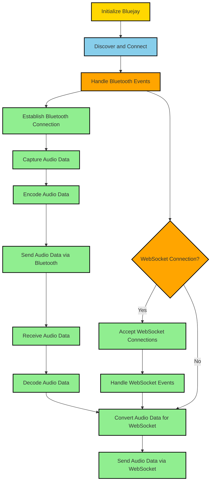

# Swift Backend App Documentation

This documentation provides an overview of setting up a Swift backend app on iMac to handle Bluetooth and WebSocket communication. It assumes you have a basic knowledge of Swift and iOS development.

## Project Setup

1. Create a new Swift project in Xcode for your backend app.
2. Install Bluejay and Starscream dependencies using one of the following methods:
    * CocoaPods: Add the dependencies to your `Podfile` and run `pod install`.
    * Carthage: Add the dependencies to your `Cartfile` and run `carthage update`.
    * Accio: Add the dependencies to your `Package.swift` file and run `accio update`.
    * Rogue: Add the dependencies to your `Package.swift` file and run `rogue update`.
    * Swift Package Manager: Add the dependencies to your `Package.swift` file and build your project.

## Bluetooth LE Communication

To handle Bluetooth Low Energy (LE) communication, we will use the Bluejay framework.

1. Import the Bluejay framework into your project.
2. Initialize Bluejay and set up the necessary delegates and callbacks to receive Bluetooth events.
3. Use Bluejay's API to discover and connect to the Bluetooth peripheral (e.g., iPhone).
4. Implement handlers for device discovery, connection status changes, and other Bluetooth events.
5. Establish and maintain the Bluetooth connection with the iPhone.

Example code for connecting to a Bluetooth peripheral using Bluejay:

```swift
import Bluejay

// Initialize Bluejay
let bluejay = Bluejay()

// Set up delegates and callbacks
bluejay.register(connectionObserver: self)
bluejay.register(scanDiscoveryObserver: self)

// Discover and connect to the Bluetooth peripheral
bluejay.scan(
    duration: .seconds(10),
    serviceIdentifiers: [YourServiceIdentifier],
    discovery: { [weak self] (discovery, discoveries) in
        // Handle device discovery
    },
    expired: { [weak self] (discoveries) in
        // Handle scan expiration
    }
)

// Implement connection observer delegate methods
extension YourViewController: ConnectionObserver {
    func bluetoothAvailable(_ available: Bool) {
        // Handle Bluetooth availability changes
    }

    func connected(_ peripheral: Peripheral) {
        // Handle successful connection
    }

    func disconnected(_ peripheral: Peripheral) {
        // Handle disconnection
    }
}
```

Ensure you handle errors and connection interruptions for reliable Bluetooth communication.

## Audio Call Streaming

To capture audio data from the iPhone's microphone and transmit it to the iMac backend, we will use the AVFoundation framework.

1. Import the AVFoundation framework into your project.
2. Use AVFoundation to capture audio data from the iPhone's microphone.
3. Encode the captured audio data into a suitable format for transmission.
4. Send the encoded audio data to the iMac backend through the established Bluetooth connection.
5. Implement decoding mechanisms on the iMac to receive and process audio data from the iPhone.

Ensure you handle errors and interruptions to ensure a smooth audio streaming experience.

## WebSocket Communication

To enable WebSocket communication with web UI clients, we will use the Starscream framework.

1. Import the Starscream framework into your project.
2. Set up a WebSocket server within your Swift backend app using Starscream.
3. Initialize a WebSocket server and configure it to listen on a specific port.
4. Accept incoming WebSocket connections and handle WebSocket events using Starscream's delegate methods.
5. Convert the received audio data from the Bluetooth connection into the appropriate format for WebSocket transmission.
6. Send the converted audio data to connected web UI clients via WebSocket.

Example code for setting up a WebSocket server using Starscream:

```swift
import Starscream

// Initialize WebSocket server
let server = WebSocketServer()

// Configure server settings
server.host = "localhost"
server.port = 8080

// Set up WebSocket delegate
server.onEvent = { event in
    switch event {
    case .text(let text):
        // Handle received text data
    case .binary(let data):
        // Handle received binary data
    case .connected(let socket):
        // Handle new WebSocket connection
    case .disconnected(let socket, let code, let reason, let clean):
        // Handle WebSocket disconnection
    case .error(let error):
        // Handle WebSocket error
    default:
        break
    }
}

// Start the WebSocket server
server.start()
```

Ensure you handle WebSocket events, such as new connections, disconnections, and data reception, based on your application's requirements.
